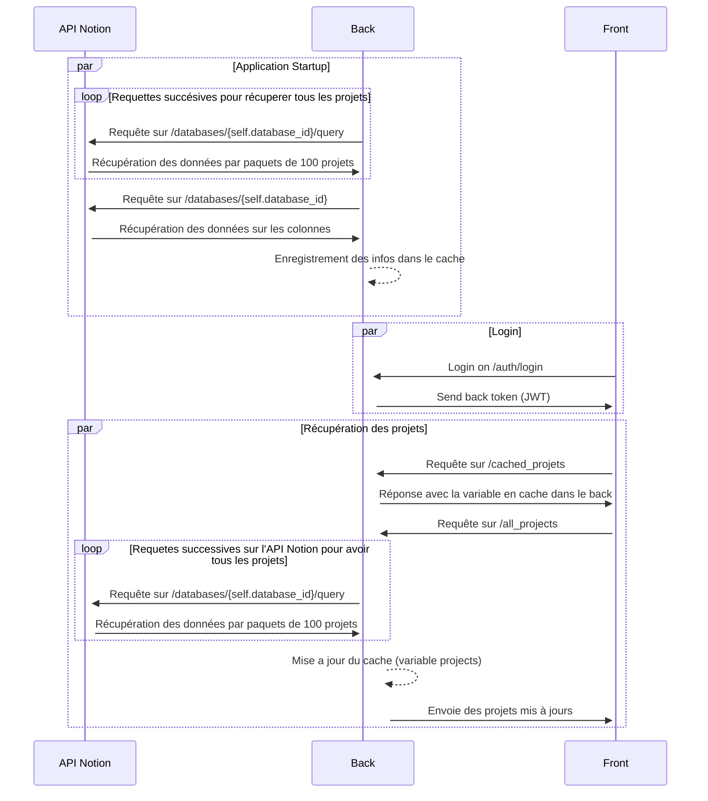
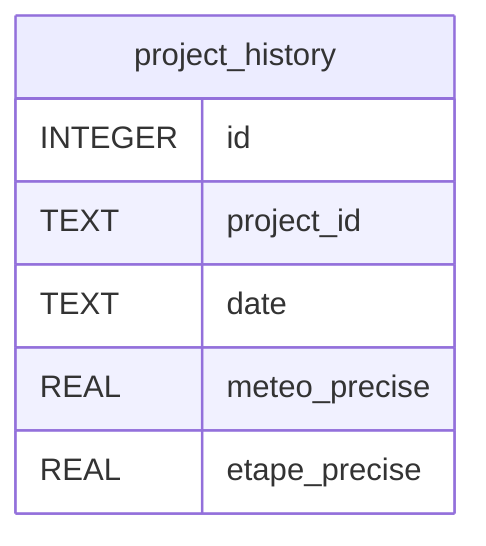

# API Monitoring Projets BACKEND

Ceci est une API développée avec FastAPI pour faire l'interface entre la base de donnée Notion et le frontend.
Le README principal du projet est disponible [ici](../README.md).

## Table des matières

-   [Vocabulaire](#vocabulaire)
    -   [Conventions de nommage](#conventions-de-nommage)
    -   [Arborescence](#arborescence)
-   [Liste des routes](#liste-des-routes)
-   [Fonctionnement](#fonctionnement)
-   [Base de données](#base-de-données)
-   [Installation](#installation)
    -   [Variables d'environnement](#variables-denvironnement)

## Vocabulaire

### Conventions de nommage

Pour la cohérence du code, il est important de respecter les conventions suivantes :

-   `snake_case` pour les noms de variables et de fonctions
-   `snake_case` pour les noms des fichiers
-   `PascalCase` pour les noms des classes

### Arborescence

L'arborescence du backend est la suivante :

<pre>
backend
├── data                   dossier de stockage de la base sqlite
├── utils
│   ├── auth.py            fichier de gestion de l'authentification
│   ├── env.py             fichier de gestion des variables d'environnement
│   ├── logger.py          fichier de gestion des logs
│   ├── notion.py          fichier de gestion de l'intégration avec Notion
│   ├── parse_notion.py    fichier de gestion de la récupération des données de Notion
│   ├── sqlite.py          fichier de gestion de la base de données sqlite
│   └── update_project.py  fichier de gestion de la mise à jour des projets
├── .dockerignore          fichier de configuration de docker
├── .env                   fichier de configuration des variables d'environnement (non présent sur le repo)
├── Dockerfile             fichier de configuration de docker
├── main.py                fichier principal de l'API
├── README.md              fichier de description du projet
├── requirements.txt       fichier de configuration des dépendances
├── run.bat                fichier de lancement de l'API (Windows)
└── schema.py              fichier de définition des schémas de données
</pre>

## Liste des routes

### Endpoint de test

-   GET `/`: Endpoint de test pour vérifier que l'API est bien en ligne.

### Endpoints pour l'authentification

-   POST `/auth/login`: Endpoint pour l'authentification.

### Endpoints relatifs à Notion

-   GET `/cached_projects`: Retourne la liste projets dans le cache.
-   GET `/all_projects`: Retourne la liste projets.
-   GET `/project/{project_id}`: Retourne un projet en fonction de son id.
-   GET `/columns_data`: Retourne les données des colonnes de la base de données.
-   GET `/project_history/{project_id}`: Donne l'historique d'un projet.
-   GET `/all_projects_history`: Donne l'historique de tous les projets enregistrés.
-   POST `/update_meteo/{project_id}`: Met à jour la météo précise d'un projet.
-   POST `/update_etape/{project_id}`: Met à jour l'étape précise d'un projet.
-   POST `/update_etape_meteo/{project_id}`: Met à jour l'étape précise et la météo précise d'un projet.
-   POST `/init_etape_meteo/`: Met à jour l'étape précise et la météo précise d'un projet quand on n'a pas de données.

A noter qu'une liste des endpoints est disponible sur l'URL `/docs` (http://localhost:8000/docs) de l'API et il est possible de tester les endpoints directement depuis cette page interactive.

## Fonctionnement

Les 3 principales fonctionnalités de l'APi sont décrites sur le schéma ci-dessous :



Les autres requêtes sont des requêtes simples qui récupèrent des données sur l'API Notion et les renvoient au frontend.

## Base de données

La base de données utilisée est une base de données sqlite. Elle est stockée dans le dossier `data` à la racine du dossier `backend`. Elle est composée de 1 table :

-   `project_history` : Table qui contient l'historique méteo précise et étape précise de chaque projet.



## Installation

Pour installer et exécuter cette API, vous devez effectuer les étapes suivantes :

1. Cloner ce repository.
2. Creer un environnement virtuel : `python -m venv venv`.
3. Activer l'environnement virtuel : `venv\Scripts\activate` (Windows) ou `source venv/bin/activate` (Linux).
4. Installer les dépendances : `pip install -r requirements.txt`.
5. Changer les variables d'environnement dans le fichier `.env` (voir la section suivante).
6. Lancer l'API : `uvicorn main:app --reload` (Windows) ou `uvicorn main:app --reload --port 8000` (Linux).

### Variables d'environnement

Créez un fichier `.env` à la racine du dossier `backend` et ajoutez les variables suivantes :

```bash
NOTION_API_URL = https://api.notion.com/v1
DATABASE_ID = notion_database_id
API_TOKEN = notion_secret_token

JWT_SECRET_KEY = secret_key
```

Remplacez `notion_database_id` par l'ID de la base de données Notion que vous souhaitez utiliser, et `notion_secret_token` par la clé d'API Notion que vous avez générée. Vous pouvez trouver ces informations dans la documentation de l'API Notion. Remplacez `secret_key` par une clé secrète de votre choix.
